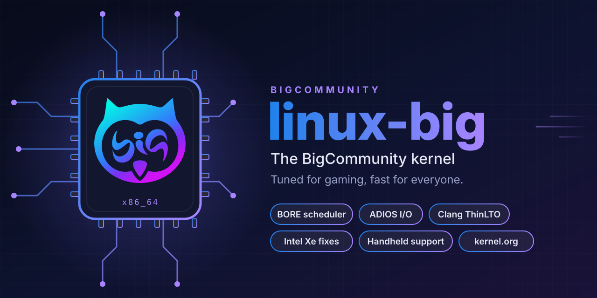

<p align="center">
  
</p>

# linux-big — the BigCommunity kernel

**linux-big** is the kernel of [BigCommunity](https://communitybig.org). It is
built from the official [kernel.org](https://www.kernel.org) sources, keeps the
configuration and hardware patches of the Manjaro kernel BigCommunity already
ships, and adds what can only be gained at compile time: a desktop-oriented CPU
scheduler, a faster idle CPU selector, an adaptive I/O scheduler, a Clang/LLVM
ThinLTO build ready for profile-guided optimisation, and BigCommunity's own
fixes for Intel graphics.

The goal is simple: a kernel that feels faster under load, whether you are
gaming or not, on the hardware our users actually have.

> **Status: first release in testing.** `linux-big` 7.2 is being validated on
> Intel and AMD machines before it is offered to everyone. See the
> [roadmap](#roadmap).

---

## Contents

- [What is inside](#what-is-inside)
- [How it differs from the Manjaro kernel](#how-it-differs-from-the-manjaro-kernel)
- [Patches](#patches)
- [Installing](#installing)
- [Checking that it works](#checking-that-it-works)
- [NVIDIA and other kernel modules](#nvidia-and-other-kernel-modules)
- [External modules (DKMS)](#external-modules-dkms)
- [System tuning stays in BigLinux](#system-tuning-stays-in-biglinux)
- [Building it yourself](#building-it-yourself)
- [Roadmap](#roadmap)
- [Credits and licenses](#credits-and-licenses)

---

## What is inside

| | Where it comes from |
|---|---|
| **Kernel source** | [kernel.org](https://www.kernel.org), stable series, verified by checksum |
| **Base configuration** | the Manjaro kernel configuration used by BigCommunity |
| **Hardware patches** | Manjaro's set: AMD GPU and display fixes, Realtek audio, Intel Wi-Fi, handhelds |
| **BORE CPU scheduler** | [firelzrd/bore-scheduler](https://github.com/firelzrd/bore-scheduler), by Masahito Suzuki |
| **POC idle CPU selector** | [firelzrd/poc-selector](https://github.com/firelzrd/poc-selector), by Masahito Suzuki |
| **ADIOS I/O scheduler** | [firelzrd/adios](https://github.com/firelzrd/adios), by Masahito Suzuki |
| **Intel Xe / i915 fixes** | BigCommunity, sent upstream and reviewed on the kernel mailing lists |
| **Compiler** | Clang/LLVM with ThinLTO and AutoFDO support |

### BORE — responsiveness under load

The **B**urst-**O**riented **R**esponse **E**nhancer builds on the kernel's
EEVDF scheduler. It tracks how long each task runs in bursts and favours
interactive work — the game, the desktop, audio — over tasks that hold the CPU
for long stretches, such as a compiler or a background download. The effect is
most visible exactly when the machine is busy: fewer stutters, a desktop that
keeps responding.

### POC — finding a free CPU faster

Every time a task wakes up — a game thread, an audio buffer, an input event —
the scheduler has to find an idle CPU to run it on, and the kernel does that by
scanning. The **P**iece-**O**f-**C**ake selector keeps a bitmap of idle CPUs and
answers in constant time instead. It does not change which task runs or how
fairly; it only shortens the path to getting it running, which matters most on
machines with many cores and workloads with many threads.

### ADIOS — adaptive I/O latency

The **A**daptive **D**eadline **I/O** **S**cheduler learns the latency of each
disk and adjusts its scheduling to it. It matters when the disk is contended — a
game loading while Steam downloads an update or the system indexes files — which
is when loading hitches appear. It is the kernel's default I/O scheduler in
linux-big (see [System tuning stays in BigLinux](#system-tuning-stays-in-biglinux)).

### Clang ThinLTO — a faster binary

The whole kernel is compiled with Clang and linked with **ThinLTO** (link-time
optimisation): the compiler sees across source files, inlines and removes code
it could not otherwise touch. The build targets generic **x86-64**, so the same
package runs on every 64-bit PC, not only on the machine that built it.

It is also built with **AutoFDO** support (`CONFIG_AUTOFDO_CLANG`). AutoFDO
recompiles the kernel from a profile of what it actually executes — collected
with `perf` on real gaming and desktop workloads — so the hot paths are laid out
and optimised for how the kernel is really used. The first profile is being
collected; until it ships, the kernel runs as a regular ThinLTO build.

The optimisation level stays at the kernel's default `-O2`. `-O3` was measured
by Phoronix across 230 tests at a 1.3% overall gain, with no measurable benefit
for gaming or desktop workloads, and it is the level upstream has declined to
support because of the miscompilations it has caused
([Phoronix](https://www.phoronix.com/review/linux-kernel-o3/9),
[Linux 6.0](https://www.phoronix.com/news/Linux-6.0-Drops-O3-Kconfig)).
Profile-guided optimisation is where the measurable gain is.

### Intel Xe fixes — for Arrow Lake and Meteor Lake

BigCommunity found and fixed a bug on Intel Arrow Lake / Meteor Lake graphics:
on the media GT, the CPU could read stale data the graphics firmware had
already written, which showed up as **TLB invalidation stalls of ~2.3 s** and,
on some machines, as freezes under video workloads. The fix implements
hardware workaround `Wa_22016122933`, which the older i915 driver had and the
Xe driver never inherited.

The series was sent upstream and reviewed by the Xe maintainers
([issue 8678](https://gitlab.freedesktop.org/drm/xe/kernel/-/work_items/8678)).
linux-big carries it until it reaches a kernel release.

---

## How it differs from the Manjaro kernel

The Manjaro configuration already has most of what a desktop kernel needs:
1000 Hz timer, full dynamic preemption, `NO_HZ_FULL`, RCU boosting, transparent
huge pages, MGLRU, `sched_ext` and `ntsync`. linux-big keeps all of it and
changes only this:

| Option | Manjaro | linux-big |
|---|---|---|
| Compiler | GCC | **Clang/LLVM** |
| Link-time optimisation | none | **ThinLTO** (`CONFIG_LTO_CLANG_THIN`) |
| CPU scheduler | EEVDF | **EEVDF + BORE** (`CONFIG_SCHED_BORE`) |
| Idle CPU selection | linear scan | **POC** (`CONFIG_SCHED_POC_SELECTOR`) |
| Profile-guided optimisation | no | **ready** (`CONFIG_AUTOFDO_CLANG`) |
| Default I/O scheduler | — | **ADIOS** (`CONFIG_MQ_IOSCHED_DEFAULT_ADIOS`) |
| Intel Xe TLB workaround | no | **yes** (`Wa_22016122933`) |
| Kernel name | `-MANJARO` | `-big` |

These options are checked at build time: if a future kernel release silently
drops one of them, the build fails instead of shipping without it.

---

## Patches

All patches live in [`linux-big/`](linux-big) and are applied in the order
listed in the [PKGBUILD](linux-big/PKGBUILD).

**BigCommunity — Intel graphics**

| Patch | What it does |
|---|---|
| `0101` `drm/xe: Capture devcoredump on TLB invalidation timeout` | records the firmware state when a TLB invalidation times out |
| `0102` `drm/xe: Log when a timed out TLB invalidation ack finally arrives` | tells a lost acknowledgement from a late one |
| `0103` `drm/xe: Implement Wa_22016122933` | **the fix**: GuC-shared memory on the media GT is mapped uncached |
| `drm/xe/mcr: Keep GT forcewake during MCR steering` | ports i915's MCR locking; removes a warning on resume |
| `drm/xe/mcr: Sanitize steering semaphore on GT resume` | releases a semaphore left held across suspend |
| `drm/i915/vrr: Check TRANS_PUSH_SEND after DSB commit` | removes the `DSB poll error` at boot on Arrow Lake |
| `drm/xe: Scope LNL_FLUSH_* workaround to affected CPUs` | applies a CPU scheduling workaround only where it is needed (by Matthew Brost) |

**Schedulers**

| Patch | Version |
|---|---|
| `0200-sched-bore` | BORE 6.8.0 |
| `0201-block-adios` | ADIOS 3.3.0r2 |
| `0202-sched-poc-selector` | POC 2.6.3 |

**From the Manjaro kernel** — AMD GPU race fix and brightness curve check, USB
VHCI suspend, Realtek audio, Intel Wi-Fi, unprivileged user namespaces sysctl,
`simpledrm` with NVIDIA, and handheld support: ASUS ROG Ally and Ally X, Zotac
Zone, Steam Deck and OrangePi NEO.

---

## Installing

linux-big is published in the BigCommunity repositories and installs next to
your current kernel — it does not replace it.

```bash
sudo pacman -S linux-big linux-big-headers
```

The boot image is `/boot/vmlinuz-linux-big`; pick **linux-big** in the GRUB menu
at the next boot. Keep another kernel installed as a fallback.

---

## Checking that it works

```bash
uname -r                                  # 7.2.x-N-big
sudo dmesg | grep -i "BORE CPU Scheduler" # BORE is active
sysctl kernel.sched_bore                  # 1 = enabled
sysctl kernel.sched_poc_selector          # 1 = enabled
cat /sys/block/*/queue/scheduler          # adios is listed, the active one in [brackets]
zgrep LTO_CLANG_THIN /proc/config.gz      # CONFIG_LTO_CLANG_THIN=y
```

BORE and POC can be switched off at runtime, for comparison, with
`sudo sysctl kernel.sched_bore=0` and `sudo sysctl kernel.sched_poc_selector=0`.

---

## NVIDIA and other kernel modules

Like the Manjaro kernels, linux-big has prebuilt modules, installed by mhwd
the same way (`<kernel>-nvidia-open` and so on):

| Package | For |
|---|---|
| `linux-big-nvidia-open` | NVIDIA, Turing (RTX 20) and newer, open modules |
| `linux-big-nvidia` | NVIDIA, Turing and newer, proprietary modules |
| `linux-big-nvidia-580xx-open`, `linux-big-nvidia-580xx` | NVIDIA 580xx, for older cards |
| `linux-big-broadcom-wl` | Broadcom BCM43xx Wi-Fi |
| `linux-big-bbswitch` | switching off the discrete GPU of Optimus laptops |

They are built with dkms from the driver packages in Manjaro's repositories —
no driver code lives here — and each one depends on one exact linux-big and
one exact driver version. That is what keeps an update from breaking graphics:
if a new kernel or a new NVIDIA driver is published before its module, pacman
holds that update back instead of booting without a driver.

Nobody rebuilds them by hand. The [watcher](.github/workflows/watch-manjaro.yml)
compares, every 30 minutes and for both the testing and stable branches, what
the modules should be — the driver users get, on the current linux-big — with
what BigCommunity has published, and dispatches a build of every module that is
behind. The driver version is resolved the way pacman does it: from the first
repository in the users' order that has it — BigLinux, then Manjaro, then
BigCommunity — so a driver BigLinux publishes ahead of Manjaro is followed too.
A new driver is picked up in Manjaro testing, days before it reaches stable.

The kernel build itself checks the other direction: in the CI, `check()` builds
the NVIDIA open driver against the new kernel, and a kernel it does not build
against is not published.

## External modules (DKMS)

A kernel built with Clang and LTO needs its external modules built with the same
toolchain. `linux-big-headers` depends on `clang`, `llvm` and `lld` and sets
`LLVM=1` in its build Makefile, so DKMS modules are compiled with Clang
automatically — the NVIDIA DKMS packages were tested this way too. No action is
needed; an explicit `LLVM=` on the command line still overrides it.

---

## System tuning stays in BigLinux

BigLinux already tunes the running system — sysctl values for gaming and
memory, I/O scheduler rules per disk type (`auto-rules-io`). linux-big does not
override any of that: it works at the level only a kernel build can reach.

That includes the I/O scheduler. ADIOS is the kernel's default, but BigLinux's
udev rules pick a scheduler per disk at boot, and they win. To try ADIOS on a
disk yourself:

```bash
echo adios | sudo tee /sys/block/nvme0n1/queue/scheduler
```

---

## Building it yourself

### Requirements

- An Arch-based system (BigCommunity, BigLinux, Manjaro, Arch).
- About **30 GB** of free disk space and **16 GB of RAM** or more; the ThinLTO
  link is the memory-hungry step.
- A few hours of CPU: about 50 minutes on a 14-core desktop, much longer on a
  laptop.

### Build and install the kernel

```bash
git clone https://github.com/big-comm/big-kernel
cd big-kernel/linux-big
makepkg -s
```

`makepkg -s` installs the build dependencies (Clang, LLVM, Rust, ...), downloads
the kernel from kernel.org, applies the patches and builds. On a machine with
little memory, or to keep it usable while it builds, limit the parallel jobs:

```bash
MAKEFLAGS=-j8 nice makepkg -s
```

Then install both packages; they go next to your current kernel:

```bash
sudo pacman -U linux-big-*.pkg.tar.zst
```

Boot **linux-big** from the GRUB menu, and remove another kernel only once it
has booted fine.

### Build a module

With `linux-big-headers` of the same version installed:

```bash
cd big-kernel/linux-big-nvidia-open   # or any linux-big-* directory
makepkg -s
sudo pacman -U linux-big-nvidia-open-*.pkg.tar.zst
```

The module reads the kernel version from `../linux-big/PKGBUILD` and the
driver version from your repositories, so it builds for the kernel and driver
you have.

### Notes

- A local build does not run the NVIDIA check the CI runs; it would install
  the NVIDIA driver on your machine.
- To tweak the configuration, edit `linux-big/config`. The options listed in
  `_required_options` in the PKGBUILD must stay: the build refuses to go on
  without them.

### How the official packages are built

Official packages are built by the BigCommunity CI
([build-package](https://github.com/big-comm/build-package)). The repository
holds one directory per package, and the CI builds the one it is asked for.

```
big-kernel/
├── linux-big/                  # the kernel: PKGBUILD, config, patches
├── linux-big-nvidia*/          # NVIDIA modules
├── linux-big-broadcom-wl/      # Broadcom Wi-Fi module
├── linux-big-bbswitch/         # Optimus GPU switch module
└── .github/
    ├── workflows/              # the module watcher
    ├── scripts/                # the watcher and its tests
    └── assets/                 # images for this page
```

---

## Roadmap

- [x] linux-big 7.2 — BORE, ADIOS, POC, Clang ThinLTO, Intel Xe fixes
- [x] Built ready for AutoFDO
- [ ] Validation on Intel (Arrow Lake) and AMD (Zen 2) machines, and with NVIDIA DKMS
- [ ] **linux-big-lts** — the 6.18 long-term series, as a conservative fallback
- [x] NVIDIA, `broadcom-wl` and `bbswitch` modules, kept in step automatically
- [ ] Selectable in the BigCommunity ISO builder
- [ ] **AutoFDO profile** from real gaming and desktop workloads, shipped in the package
- [ ] **Propeller** on top of AutoFDO
- [ ] Published benchmarks: scheduler latency, frame times and build times, side by side with other kernels on the same hardware

Claims about speed will be made here with numbers, once the benchmarks exist.

---

## Credits and licenses

- The Linux kernel and its patches are licensed under the
  [GPL-2.0](https://www.kernel.org/doc/html/latest/process/license-rules.html).
- BORE, ADIOS and the POC selector are the work of Masahito Suzuki, GPL-2.0.
- The hardware patches come from the Manjaro kernel team and their upstream
  authors, named in each patch.
- The Intel Xe fixes are by Tales A. Mendonça, with review by Matthew Brost and
  testing by Navon John Lukose; the workaround approach was suggested by
  Daniele Ceraolo Spurio.
- The packaging in this repository is under the [MIT license](LICENSE).

Maintained by [BigCommunity](https://communitybig.org).
